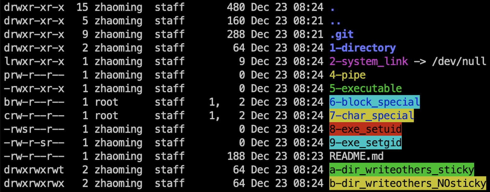
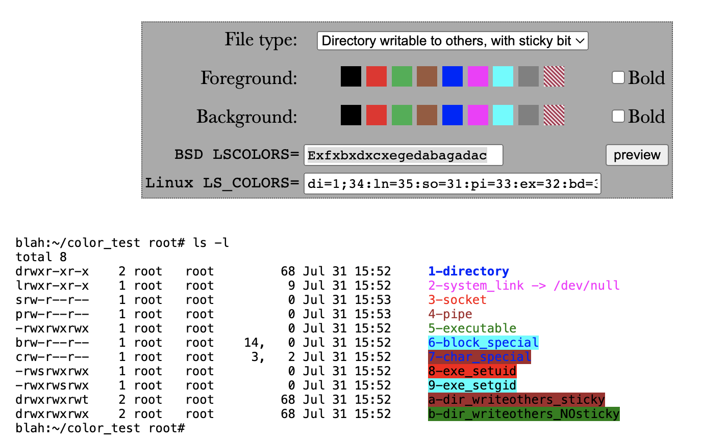

自动生成所有 Linux 的文件类型，用于测试颜色配置
===============================================

# 使用方法

```shell
. ./run.sh
```

> 脚本会创建以下文件

- Directory
- Symbolic link
- Socket
- Pipe
- Executable
- Block special
- Character special
- Setuid Executable
- Setgid Executable
- Directory writable to others, with sticky bit
- Directory writable to others, no sticky bit



# 调整成自己喜欢的颜色
[点击打开在线生成器](https://geoff.greer.fm/lscolors/)


# 修改系统环境变量

```shell
export LSCOLORS='Exfxbxdxcxegedabagadac' #指定颜色
```

enjoy! :smiley: